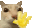

## Hi, I'm Ngô Chí Thuận 

I'm currently studying Software Engineering at Ton Duc Thang University. I love bringing my ideas from my head to reality.

### ~~Fun~~ Facts:

- I love Pokemon (especially Furret & Snorlax)
- I don't like chocolate
- Hobbies: reading, drawing, programming

### Languages

- Languages: Golang, Python, HTML5, CSS3, JavaScript
- Frameworks/Libraries: Gin, FastAPI, ExpressJS, Bootstrap
- Database: PostgreSQL, mySQL, MongoDB, Redis
- Hosting: AWS, CloudFare
- Tools: Git, Github, Postman
- Others: Docker, NodeJS

### Contact

Email: <a href="mailto:ngochithuan.dev@gmail.com">ngochithuan.dev@gmail.com</a>
 
Facebook: <a href="https://www.facebook.com/chithuan.ngo.47/">ngochithuan47</a>
